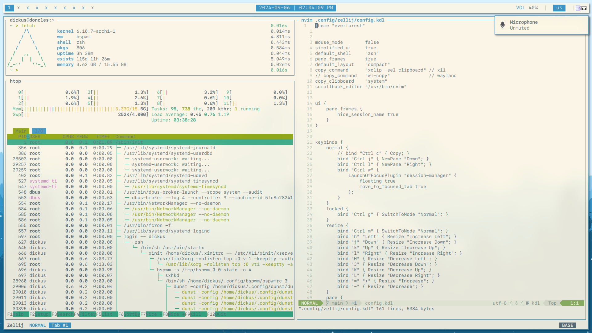
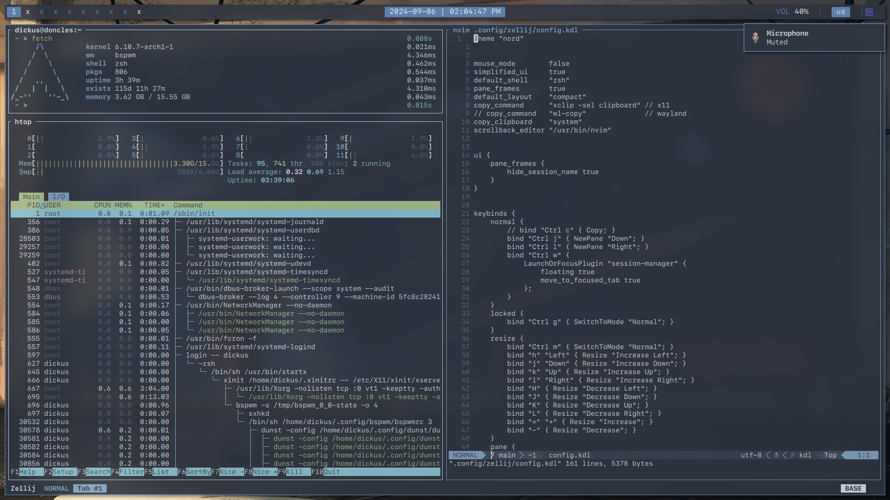

My dotfiles for a bunch of apps with Xorg.

**[[Scripts](SCRIPTS.md)] × [[Screenshots](#screenshots)] × [[Software list](#software-list)] × [[Important](IMPORTANT.md)] × [[Installation](#installation)]**


## Screenshots




## Software list
* [alacritty](https://github.com/alacritty/alacritty) for alternative terminal emulator.
* [bat](https://github.com/sharkdp/bat) for `cat` replacement.
* [bspwm](https://github.com/baskerville/bspwm) for window manager.
* [ctpv](https://github.com/NikitaIvanovV/ctpv) for image preview in `lf`.
* [dunst](https://github.com/dunst-project/dunst) for notifications.
* [exa](https://github.com/ogham/exa) for `ls` replacement.
* [fastfetch](https://github.com/fastfetch-cli/fastfetch) for fetching system info to flex on /r/unixporn, obviously.
* `fcron` for scheduled scripts run.
* [feh](https://github.com/derf/feh) for viewing images and set wallpapers.
* [ffmpegthumbnailer](https://github.com/dirkvdb/ffmpegthumbnailer) for video preview in `lf`.
* [fuseiso](https://sourceforge.net/projects/fuseiso/) for handling .iso and .mdf/.mds files.
* [fzf](https://github.com/junegunn/fzf) for fuzzy files search.
* [imagemagick](https://github.com/ImageMagick/ImageMagick) for making screenshots.
* [kitty](https://github.com/kovidgoyal/kitty) for main terminal emulator.
* [lf](https://github.com/gokcehan/lf) for file manager.
* `librewolf` for browser.
* [mpv](https://github.com/mpv-player/mpv) for media.
* `nordzy` for [icons](https://github.com/alvatip/Nordzy-icon) and [cursor](https://github.com/alvatip/Nordzy-cursors).
* [nvim](https://github.com/neovim/neovim) for text and code editor.
* [oh-my-zsh](https://github.com/ohmyzsh/ohmyzsh) for `zsh` customization.
* `p7zip` for handling .rar and .7z archives.
* [picom](https://github.com/yshui/picom) for more fancy system look.
* [polybar](https://github.com/polybar/polybar) for the bar at the top of the screen.
* [ripgrep](https://github.com/BurntSushi/ripgrep) for `grep` replacement.
* [rofi](https://github.com/davatorium/rofi) for starting apps, using calculator and some other misc stuff.
* [rofimoji](https://github.com/fdw/rofimoji) `rofi` extension for Unicode chars (`alacritty` doesn't let you use Shift-Ctrl-U to insert them).
* [sf-mono-nerd](https://github.com/epk/SF-Mono-Nerd-Font) for fonts.
* [sxhkd](https://github.com/baskerville/sxhkd) for keybindings.
* [ueberzug](https://github.com/ueber-devel/ueberzug/) for image preview in `lf`.
* `unzip` for handling .zip archives.
* [wireguard](https://github.com/WireGuard) for VPN.
* [xclip](https://github.com/astrand/xclip) for system clipboard.
* `xsetroot` to fix cursor changing on desktop.
* [zathura](https://github.com/pwmt/zathura) for reading .pdf files.
* [zellij](https://github.com/zellij-org/zellij) for using ssh and flex fancy look on /r/unixporn.
* [zoxide](https://github.com/ajeetdsouza/zoxide) for `cd` replacement.
* [zsh](https://github.com/ohmyzsh/ohmyzsh) for shell.


## Installation
```
git clone git@github.com:dickus/dotfiles.git .dotfiles
```

If you don't need some configs, remove them from repo after you clone it.

Then I recommend you to use [stow](https://github.com/aspiers/stow/) to manage dotfiles.
```
cd .dotfiles && stow . && cd
```

And load `fcron`:
```
fcrontab $HOME/.config/cron/crontab
```

