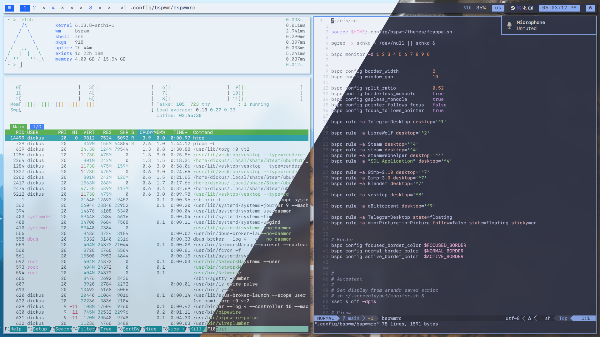
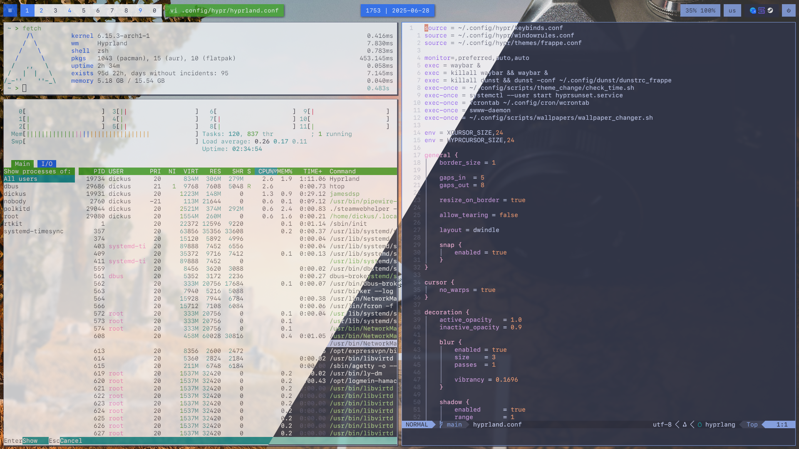

My dotfiles for a bunch of apps.

**[[Preview](#preview)] × [[Dependencies](#dependencies)] × [[Installation](#installation)]**


## Preview
### BSPWM


### Hyprland


## Dependencies
### X11/Hyprland
* [alacritty](https://github.com/alacritty/alacritty) or [kitty](https://github.com/kovidgoyal/kitty).
* [bat](https://github.com/sharkdp/bat)
* [ctpv](https://github.com/NikitaIvanovV/ctpv), [ffmpegthumbnailer](https://github.com/dirkvdb/ffmpegthumbnailer), [ueberzug](https://github.com/ueber-devel/ueberzug/)
* [dunst](https://github.com/dunst-project/dunst)
* [exa](https://github.com/ogham/exa)
* [fastfetch](https://github.com/fastfetch-cli/fastfetch)
* `fcron`
* [fuseiso](https://sourceforge.net/projects/fuseiso/)
* [fzf](https://github.com/junegunn/fzf)
* [lf](https://github.com/gokcehan/lf) or [yazi](https://github.com/sxyazi/yazi)
* `librewolf`
* `mkisofs`
* [mpv](https://github.com/mpv-player/mpv)
* [nvim](https://github.com/neovim/neovim)
* [zsh](https://github.com/ohmyzsh/ohmyzsh), [oh-my-zsh](https://github.com/ohmyzsh/ohmyzsh)
* `7zip`, `unzip`
* [ripgrep](https://github.com/BurntSushi/ripgrep)
* [rofi](https://github.com/davatorium/rofi) + [rofimoji](https://github.com/fdw/rofimoji) if you use `alacritty`
* [rofi-calc](https://github.com/svenstaro/rofi-calc)
* [sf-mono-nerd](https://github.com/epk/SF-Mono-Nerd-Font)
* [zathura](https://github.com/pwmt/zathura)
* [zoxide](https://github.com/ajeetdsouza/zoxide)

### X11
* [bspwm](https://github.com/baskerville/bspwm) + `xsetroot`
* [feh](https://github.com/derf/feh)
* [imagemagick](https://github.com/ImageMagick/ImageMagick)
* [picom](https://github.com/yshui/picom)
* [polybar](https://github.com/polybar/polybar)
* [sxhkd](https://github.com/baskerville/sxhkd)
* [xclip](https://github.com/astrand/xclip)

### Hyprland
* [grim](https://sr.ht/~emersion/grim/) + [slurp](https://github.com/emersion/slurp)
* [hyprland](https://github.com/hyprwm/Hyprland) + [hypridle](https://github.com/hyprwm/hypridle) + [hyprlock](https://github.com/hyprwm/hyprlock)
* [hyprpicker](https://github.com/hyprwm/hyprpicker)
* [hyprsunset](https://github.com/hyprwm/hyprsunset)
* [swww](https://github.com/LGFae/swww)
* [waybar](https://github.com/Alexays/Waybar)
* [wf-recorder](https://github.com/ammen99/wf-recorder)
* [wl-clipboard](https://github.com/bugaevc/wl-clipboard)
* `xdg-desktop-portal-wlr` + `xdg-desktop-portal-hyprland` + `xdg-desktop-portal-gtk`


## Installation
```
git clone git@github.com:dickus/dotfiles.git .dotfiles
```

If you don't need some configs, remove them from repo after you clone it.

Then I recommend you to use [stow](https://github.com/aspiers/stow/) to manage dotfiles.
```
cd .dotfiles && stow . && cd
```
